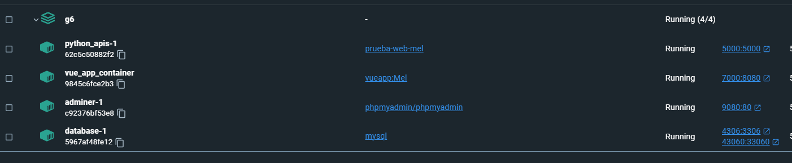
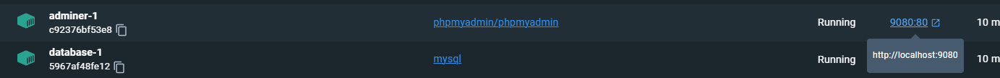
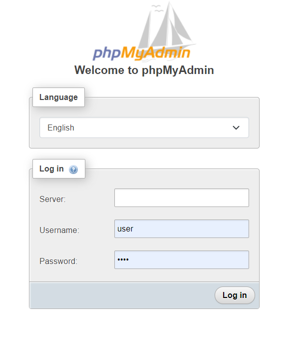
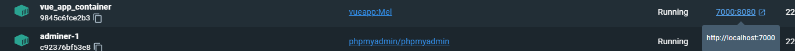

if the docker vue part comment line 16, uncomment line 17 and then start again over line 16.
why?
no idea

## how to make it work:
1. INSTALL DOCKER DESKTOP 
2. Install gitbash
3. While having the docker desktop open, in terminal bash use the following command:
docker compose up -d
4. Docker is gonna download a bunch of stuff, cause what is doing actually is installing everything there, this will work even if you don't have vue installed, or flask or anything.
5. After that, the docker app should look like this

6. Since you just installed everything ur db is literally empty, we are creating a table and an insert (we are not importing the full DB now because it doesn't even work at this point)
so we are clicking here

and we get this

user: user

password: 1234

7. We click on the left side on wolfcampus_db and then we go import
8. We import this file [dbthing](\Assets\dbstuffnotMain\account.sql)
9. Our temporaty db is done, once I'm done with the sql alchemy model we will be able to import the full one but at this point it wouldn't even work.
10. To test the swagger (this is how we are individually testing that our apis are working) we go here:
http://localhost:5000/api/ui
11. To run the vue proyect we click here:

